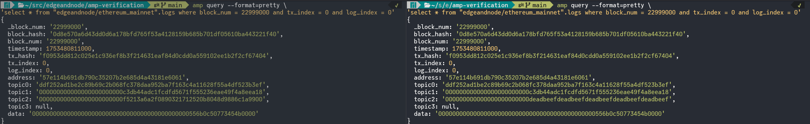
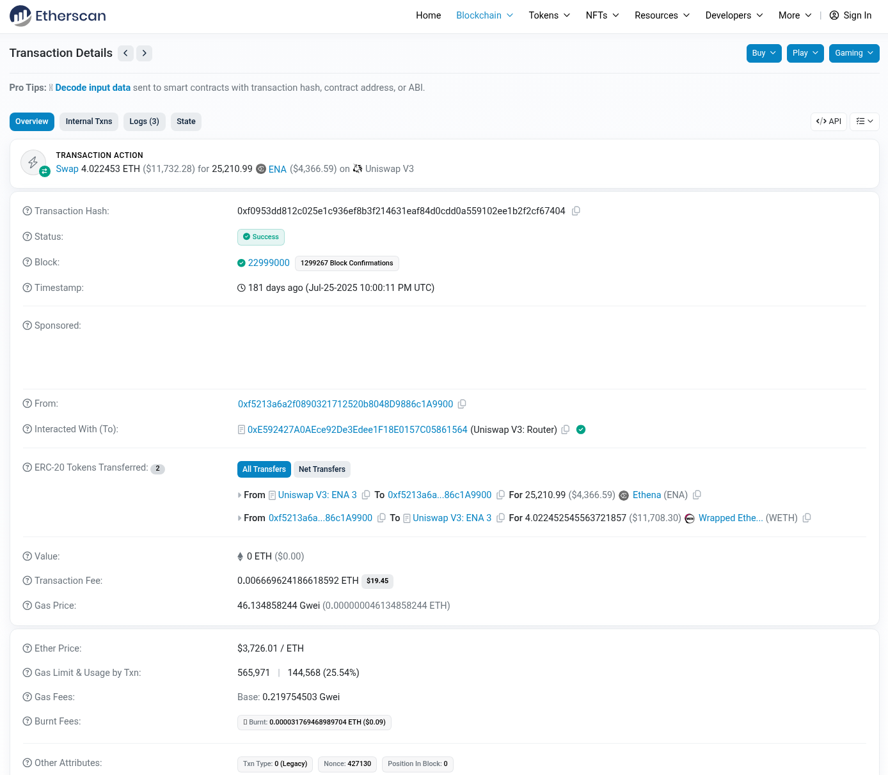
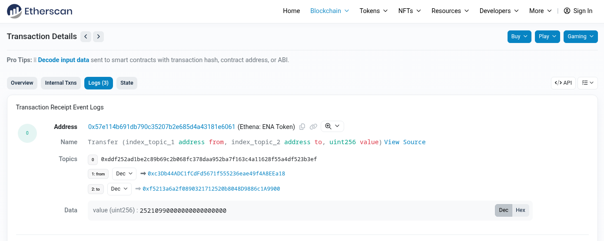

# Amp Verifiable Extraction

*Catching Corrupted Blockchain Data Before It Corrupts Your Queries*

When you query blockchain data, you are trusting that your data source reflects the canonical chain state.
Providers of this data at the start of the data pipelines may introduce errors through bugs, misconfiguration, or malicious intent.
A missing transaction, a corrupted log, or even an incorrect ordering of events may go unnoticed until it causes incorrect behaviors downstream.

Amp addresses this concern by verifying extracted data using the cryptographic primitives core to blockchain systems.
This document describes how that verification works.
We use Ethereum as the primary example, but these concepts apply to the extent each chain’s architecture allows.

## A Brief Cryptography Glossary

Before diving into verification, we need to introduce a few cryptographic concepts used in the Ethereum Virtual Machine (EVM).

**hash**: You can think of it as a unique fingerprint of the input to an irreversible function. A hash function will always return the same output for a given input, but any changes to that input such as omission, addition, reordering, etc. will produce a different output. Hashes can be used for many applications, such as checking for data integrity.

**commitment**: In this context, the commitment is also a hash as we are concerned with data integrity as a first step.

**signature**: A signature associates some data, a "message", with the holder of a private key. In the case of the EVM, a private key is a wallet capable of creating signatures, and the corresponding public key is identified by an address. Assuming the private key is held by a single entity, then the signature proves that the entity witnessed the message data.

**RLP encoding**: This is the serialization format used by the EVM, and is therefore the format used as input to the Keccak-256 hash function used on the Ethereum execution layer.

**Merkle Patricia Trie**: A data structure designed to produce efficient proofs that certain elements of the on-chain state are present, such as "transaction `t` present in block `b`". This structure provides a root hash that is a commitment to the presence of the entire sequence of entries in a block.

## Verifying EVM RPC Raw Datasets

For EVM RPC raw datasets, Amp extracts RPC data into 3 tables: blocks, logs, and transactions.

The blocks table contains the fields of each block header -- such as block number, parent block hash, transactions root, and receipts root.
Verifying the blocks table is the most straightforward, since it is just a matter of RLP-encoding the fields and passing them through the Keccak-256 hash function.
If the output matches the block hash, then we know that the exact set of values for the block header fields is well-formed.

The transactions table contains transaction data for each block -- such as the sender and recipient addresses, value transferred, input data, and a signature from the sender.
To verify this table, we reconstruct each transaction in its RLP-encoded format.
This encoding varies by transaction type since Ethereum has evolved to support multiple types including legacy transactions, access lists (EIP-2930), dynamic fees (EIP-1559), blob data (EIP-4844), and account abstraction (EIP-7702).
Additional transaction types are also needed for L2 chains like Arbitrum or Base.
Once re-encoded, the transactions are used to reconstruct the Merkle Patricia Trie to get the root commitment.
The sequence of transactions in the table for some block is well-formed if the Merkle root commitment matches the transactions root field of the block header.

The logs table contains structured event logs emitted by transactions during their execution.
Similar to transactions, we re-encode the logs and combine them with data from the transactions table to reconstruct the Merkle Patricia Trie for transaction receipts.
The sequence of logs in the table is well-formed if the Merkle root commitment matches the receipts root field of the block header.

Since each re-computed hash is verified against the corresponding hash in the block header (block hash, transactions root, receipts root), we prove that the block data across these tables is well-formed. This means that all transactions and logs are present, correctly ordered, and unmodified.

## Segments and Query Execution

Amp stores extracted data in Parquet files called segments, where each segment covers a contiguous range of blocks.
Verifying the integrity of individual blocks, as described in the previous section, is necessary but insufficient.
We also need to ensure that segments selected for query execution form a coherent chain.

Every EVM block contains the parent block hash so that they can form a chain.
Segments are similarly linked together using the same hash and parent hash of the source data.
This is stronger than just checking block numbers because block numbers alone cannot ensure a valid chain of blocks.
An example of this requirement is chain reorganization, where two blocks may be extracted with the same block number but different contents and therefore different block hashes.
The hashes are required to resolve this kind of ambiguity, which is inevitable on any blockchain that uses consensus.

For query execution, Amp selects segments by requiring them to be a view over a well-formed chain.
This maintains a consistent view of the blockchain data even in the presence of chain reorganizations, parallel extraction, or segment compaction.
Combined with per-block verification, this ensures that queries execute over data that is internally consistent, properly sequenced, and free of duplicates.

**Note**: For simplicity, we are discussing segments for a single network.
Derived datasets spanning multiple networks extend this metadata to track multiple block ranges per segment.
Some chains also require handling skipped slots, though this does not apply to EVM RPC datasets.

## Verification Example

As a concrete example of what this verification tool might detect, we created a 100,000 block Ethereum mainnet dataset (blocks 22,900,000-22,999,999) where an incorrect RPC provider has caused one log row to diverge from what is on-chain.
Running our tools as a standalone CLI against this dataset shows the following output:

The output shows that block 22,999,000 failed verification because the computed receipts root does not match the one from the block header due to a single log at index 0.

Querying the logs table at that row shows a comparison for the row in question. On the left, the query is executed against a good dataset and on the right against the dataset where the input data has been tampered with.

Specifically, the `topic2` field of the log has been altered.

Using etherscan.io, we can inspect the transaction in question to see that it is a Swap on Uniswap V3:

Drilling down to the log at index 0, we see that it is a token transfer where `topic2` is the recipient address.

This example demonstrates one kind of data inconsistency we can detect between what is on-chain and what is extracted into the Amp system before it has a chance to have SQL executed over it.

## What Verification is Currently Missing

Amp verification can quickly verify the integrity of data per block, in parallel.
Amp data management and execution engine also guarantees that queried data comes from blocks that form a valid chain, based on block hashes.
What we do not yet prove is that those block headers come from the canonical chain agreed upon by network consensus.

For example, this gap in verification would allow a misconfigured RPC provider to serve Sepolia testnet data instead of Ethereum mainnet.
It would also allow a malicious provider to serve blocks that are internally consistent but diverge from the canonical chain - blocks that pass all verification checks yet represent a false history not agreed upon via the Beacon chain.

Closing this gap requires access to consensus-layer data. On post-merge Ethereum, this means verifying that block hashes appear in the Beacon chain, which would require integrating with a light client.

A related concern is cross-chain verification, such as confirming that an L2 transaction has been finalized on L1.
This involves verifying not just data integrity but also the finality guarantees of the rollup protocol, which varies by chain.

## Conclusion

Amp's verified extraction provides a strong guarantee that the extracted datasets are internally consistent with the cryptographic commitments contained in the block headers.
Combined with Amp's segment adjacency checks, users can be confident that every query executes over a consistent view of the underlying blockchain data.
Verification can run automatically during extraction to prevent invalid data from entering the system.
It can also be run as a standalone CLI, enabling third parties to independently validate datasets from the output SQL queries.
